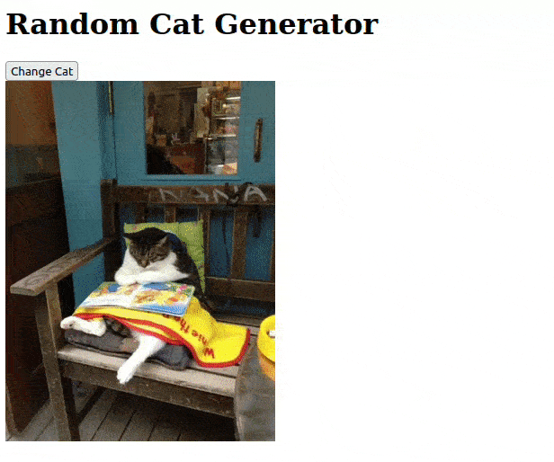

⚠️ This is just a temporary post that will probably get deleted in the future.

## What is htmx

To quote the creators of htmx:
> htmx gives you access to AJAX, CSS Transitions, WebSockets and Server Sent Events directly in HTML, using attributes, so you can build modern user interfaces with the simplicity and power of hypertext

You can find more about it [here](https://htmx.org/).

## The application

### Why?

This app was built almost entirely by ChatGPT as part of a test for a school project named **PaaSTech**. It's a PaaS like Heroku that you can try out there: [PaaSTech.cloud](https://paastech.cloud/)

### How does it work?

When you access the application through the browser, it presents a simple webpage with a button and an image of a random cat fetched from "The Cat API". You can change the image by simply pressing the button.

This application only consists of a few functions and basic standard libraries from Go.

The core of this program resides in this `catHandler` function which is served on '/'. This function is responsible for serving the main HTML page with a random cat image and a button to fetch a new cat image.
```go
func catHandler(w http.ResponseWriter, r *http.Request) {
	cat := Cat{ImageURL: getRandomCatImageURL()}

	tmpl, err := template.New("index").Parse(`
		<!DOCTYPE html>
		<html>
		<head>
			<title>Random Cat Generator</title>
			<script src="https://unpkg.com/htmx.org/dist/htmx.js"></script>
		</head>
		<body>
			<h1>Random Cat Generator</h1>
			<button id="change-button" hx-get="/change" hx-swap="innerHTML" hx-target="#cat-image">
				Change Cat
			</button>
			<div id="cat-image">
				
			</div>
		</body>
		</html>
	`)
	if err != nil {
		http.Error(w, err.Error(), http.StatusInternalServerError)
		return
	}

	err = tmpl.Execute(w, cat)
	if err != nil {
		http.Error(w, err.Error(), http.StatusInternalServerError)
	}
}
```

What's interesting about this snippet are the htmx tags in the html (all the `hx-...`). 
Using `hx-get`, we can directly send a get request to the '/change' endpoint without needing any fetch, axios, etc. The result of this request is then used to replace the inner HTML of the div below as stated by `hx-swap` and `hx-target`. All of this without requiring any additional JavaScript code.
The '/change' endpoint is simply returning a new `` HTML element with a new image URL fetched from the API.

### The result

Here is what the final result looks like:



You can find the entire code for this application in this [Github gist](https://gist.github.com/noetarbouriech/004c1c79b6b8d3fb0d093b1b2ded0005).

> Cover picture by [Xenia Bogarova](https://unsplash.com/@xeniabogarova) on [Unsplash](https://unsplash.com/)
